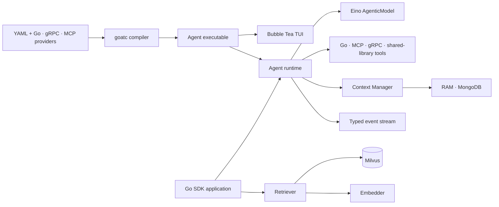

<div align="center">
  <h1>goat 🐐</h1>
  <p><strong>Compile, ship, and extend tool-using AI agents in Go.</strong></p>
  <p>
    <a href="https://go.dev/"></a>
    <a href="https://github.com/torrischen/goat/actions/workflows/ci.yml"></a>
    <a href="https://pkg.go.dev/github.com/torrischen/goat/agent/react"></a>
    <a href="LICENSE"></a>
  </p>
  <p>
    <a href="#goatc-agent-compiler">goatc</a> ·
    <a href="#features">Features</a> ·
    <a href="#sdk-quick-start">SDK quick start</a> ·
    <a href="#packages">Packages</a> ·
    <a href="#documentation">Documentation</a>
  </p>
</div>

`goat` combines an agent compiler, an asynchronous runtime, persistent conversation context, extensible tools, Milvus retrieval, multi-provider embeddings, structured prompt building, and typed streams in one Go module. Its first-class [`goatc`](goatc) compiler turns YAML plus provider-backed tools—local Go plugins, gRPC services, and MCP servers—into a single distributable Agent executable with an interactive Bubble Tea UI. The agent layer is built on [CloudWeGo Eino](https://github.com/cloudwego/eino) and accepts any `model.AgenticModel` implementation.

## Features

- **Agent compiler (`goatc`)** — combine local Go plugins, multiple gRPC tools, and multiple MCP servers through one provider-based YAML schema, then emit one interactive executable.
- **Built-in terminal UI** — stream final answers, inspect tool execution in real time, continue conversations, steer active runs, cancel work, and monitor token usage.
- **Native tool calling** — execute one or more model-selected tools in an agent loop.
- **Model agnostic** — use Eino adapters for OpenAI, Azure OpenAI, Claude, Gemini, or another compatible provider.
- **Context management** — choose RAM or MongoDB and resume a conversation by `ContextUID`.
- **Run-level forking** — branch a settled `RunSignature` into an independent conversation without replaying the model.
- **Live steering** — queue one or more user messages while an agent runs and apply them at the next protocol-safe turn boundary.
- **Context compression** — compact long tool histories with precise, aggressive, or no-model discard strategies.
- **Extensible tools** — register Go functions, MCP tools, Go shared libraries, or gRPC plugins.
- **Planning and skills** — expose built-in planning tools and load skills on demand from a `skills/` directory.
- **Streaming execution** — consume typed model, tool, steering, final-answer, and terminal events with aggregate token usage and final-answer webhooks.
- **Multimodal input and output** — pass image URLs, Base64 data, or binary images through supported models and tools.
- **Milvus retrieval** — use dense vector, BM25, or hybrid retrieval with filters, partitions, and JSON fields.
- **Reusable primitives** — multi-provider embeddings, a fluent prompt builder, and concurrent generic streams.

## goatc agent compiler

`goatc` is the shortest path from Go tools to a runnable Agent. Instead of writing model initialization, plugin loading, context management, streaming, and terminal UI glue by hand, describe the Agent in YAML and compile it:

```text
Local Go tools + gRPC services + MCP servers + goatc.yaml
                         │
                         ▼
                       goatc
                         │
                         ├── builds local tools as native .so plugins
                         ├── configures remote tool providers
                         ├── embeds normalized YAML and local plugins
                         └── builds the Bubble Tea application
                         │
                         ▼
                one distributable executable
```

### What the generated executable includes

- OpenAI, Claude/Anthropic, or Gemini model initialization driven by environment-based credentials.
- Provider-based tools: compiled and embedded Go plugins, multiple goat gRPC tool services, and MCP servers over stdio, SSE, or Streamable HTTP.
- RAM or MongoDB conversation persistence.
- ReAct or dependency-aware plan-and-execute orchestration, parallel tool execution, context compression, per-run skill directories, and special requirements.
- A Bubble Tea interface with streamed answers, live tool status and results, multi-turn history, active-run steering, cancellation, and token accounting.

A minimal project looks like this:

```text
my-agent/
├── go.mod
├── goatc.yaml
└── tools/
    ├── search/          # package main; exports New() toolplugin.ToolPlugin
    └── workspace/       # package main; exports New() toolplugin.ToolPlugin
```

```yaml
version: v1

agent:
  name: research-agent
  type: react # or plan_execute
  model_max_tokens_k: 128
  max_steps: 12
  enable_planning: true
  parallel_tools: 3
  compress: true
  skills_dir: ./skills

model:
  provider: openai
  name: gpt-5
  api_key_env: OPENAI_API_KEY

context:
  backend: ram

tools:
  # Omit provider for a backward-compatible local Go plugin.
  - name: search
    source: ./tools/search
  - provider: go_plugin
    name: workspace
    source: ./tools/workspace

  # Add as many goat gRPC tool services as needed.
  - provider: grpc
    name: translator
    address: 127.0.0.1:50051
  - provider: grpc
    address: 127.0.0.1:50052

  # Each MCP server can expose multiple tools.
  - provider: mcp
    name: filesystem
    transport: stdio
    command: npx
    args: [-y, "@modelcontextprotocol/server-filesystem", /workspace]
  - provider: mcp
    transport: streamable_http
    url: https://mcp.example.com/mcp
    headers:
      Authorization: Bearer ${MCP_TOKEN}

build:
  output: ./dist/research-agent

tui:
  welcome: Ask me to research, analyze, or modify the workspace.
```

Install, validate, build, and run:

```bash
go install github.com/torrischen/goat/goatc@latest

goatc validate -f goatc.yaml
goatc build -f goatc.yaml

export OPENAI_API_KEY="your-api-key"
export MCP_TOKEN="your-mcp-token"
./dist/research-agent
```

Set `agent.type: plan_execute` and add `agent.plan` settings to have a planner create and revise a dependency-aware plan whose steps are delegated to an internal tool-using ReAct executor. See the complete guide for the plan limits and TUI behavior.

The `tools[].provider` field is the common extension point. `go_plugin` compiles and embeds a local source directory, `grpc` imports a goat `PluginService` by address, and `mcp` initializes a stdio, SSE, or Streamable HTTP server and registers every tool it exposes. Add multiple entries of any provider type in one Agent. MCP values such as `${MCP_TOKEN}` are resolved from the runtime environment, so secrets do not need to be embedded in YAML.

Each local source directory is one plugin build unit and follows the existing `New() toolplugin.ToolPlugin` contract. The Agent executable and its local plugins are built together with the same Go toolchain and build tags. The output is one delivery artifact; at startup it extracts embedded plugins to a temporary directory because Go's `plugin.Open` requires filesystem paths. Remote-only configurations build without embedded `.so` files. A configured `skills_dir` remains a runtime directory and is not embedded.

Go plugins are built natively and supported on Linux, macOS, and FreeBSD. See the complete [`goatc` guide](goatc/README.md) for provider configuration, tool contracts, keyboard controls, and build details.

## Packages

| Package | Purpose |
| --- | --- |
| [`goatc`](goatc) | YAML-driven Agent compiler with Go plugin, gRPC, and MCP tool providers plus a Bubble Tea interface. |
| [`agent/react`](agent/react) | Asynchronous native function-calling agent runtime. |
| [`agent/planexecute`](agent/planexecute) | Dependency-aware planner and scheduler backed by a React executor. |
| [`agent/common`](agent/common) | Agent, tool, event, usage, and multimodal contracts. |
| [`agent/contextmgr`](agent/contextmgr) | Conversation state machine, typed Store contract, and RAM and MongoDB backends. |
| [`agent/tools`](agent/tools) | Planning, skills, terminal, and shell tools. |
| [`agent/toolplugin`](agent/toolplugin) | Go shared-library and gRPC tool plugins. |
| [`embedder`](embedder) | Embedding clients for OpenAI-compatible APIs, Gemini, Cohere, Voyage AI, and Ollama. |
| [`retriever/milvus`](retriever/milvus) | Vector, BM25, and hybrid Milvus retrievers. |
| [`prompt`](prompt) | Fluent Markdown prompt builder. |
| [`streaming`](streaming) | Concurrent, type-safe generic streams. |



## Requirements

- Go **1.26.6** or newer.
- Credentials for the model or embedding provider you choose.
- Milvus **2.6** only when using the retriever packages.
- Linux, macOS, or FreeBSD for `goatc` shared-library builds; Agent and plugins are built natively for the current OS and architecture.

## Installation

Install the Agent compiler from source:

```bash
go install github.com/torrischen/goat/goatc@latest
```

Prebuilt `goatc` archives for Linux, macOS, Windows, and FreeBSD (`amd64` and `arm64`) are attached to every [GitHub Release](https://github.com/torrischen/goat/releases), together with `SHA256SUMS`.

When embedding goat as a library, install only the packages your application needs:

```bash
go get github.com/torrischen/goat/agent/react
go get github.com/torrischen/goat/agent/contextmgr/ram
go get github.com/cloudwego/eino-ext/components/model/agenticopenai
```

Optional components can be added independently:

```bash
go get github.com/torrischen/goat/retriever/milvus/hybrid
go get github.com/torrischen/goat/prompt
go get github.com/torrischen/goat/streaming
```

## SDK quick start

Use this path when embedding goat directly into a Go application. For a YAML-driven, ready-to-run Agent executable, start with [`goatc`](#goatc-agent-compiler).

Set an API key:

```bash
export OPENAI_API_KEY="your-api-key"
```

Create and run an agent:

```go
package main

import (
	"context"
	"errors"
	"fmt"
	"log"
	"os"

	"github.com/cloudwego/eino-ext/components/model/agenticopenai"
	"github.com/torrischen/goat/agent/common"
	"github.com/torrischen/goat/agent/contextmgr/ram"
	"github.com/torrischen/goat/agent/react"
	"github.com/torrischen/goat/streaming"
)

func main() {
	ctx := context.Background()

	llm, err := agenticopenai.NewResponsesModel(ctx, &agenticopenai.ResponsesConfig{
		APIKey: os.Getenv("OPENAI_API_KEY"),
		Model:  "gpt-5.2",
	})
	if err != nil {
		log.Fatal(err)
	}

	// 128 means an approximately 128K-token model context window.
	agent := react.NewAgent(llm, 128, ram.NewRAMContextManager())

	signature, eventStream, err := agent.Do(ctx, &common.AgentDoArgs{
		UserInput: common.AgentUserInput{
			Text: "Explain why typed streams are useful in Go in three bullets.",
		},
		MaxStep: 8,
	})
	if err != nil {
		log.Fatal(err)
	}

	var usage *common.AgentUsage
	for {
		event, err := eventStream.ReadWithContext(ctx)
		if errors.Is(err, streaming.ErrStreamClosed) {
			break
		}
		if err != nil {
			log.Fatal(err)
		}

		switch event := event.(type) {
		case common.AssistantTextDeltaEvent:
			fmt.Print(event.Delta)
		case common.RunCompletedEvent:
			usage = event.Usage
		case common.RunFailedEvent:
			log.Fatalf("agent failed during %s: %s", event.Operation, event.Error)
		case common.RunCanceledEvent:
			log.Fatalf("agent canceled: %s", event.Reason)
		}
	}

	if usage == nil {
		usage = &common.AgentUsage{}
	}
	fmt.Printf("\nConversation: %s\n", signature.ContextUID)
	fmt.Printf("Run: %s\n", signature.RunUID)
	fmt.Printf("Tokens: prompt=%d cached=%d completion=%d\n",
		usage.PromptTokens, usage.CachedTokens, usage.CompletionTokens)
}
```

`Agent.Do` stores the user message, starts the agent loop in the background, and immediately returns a `RunSignature` plus a `common.AgentEvent` stream. The signature contains the persistent conversation `ContextUID` and a new `RunUID` for this invocation. Stream items are concrete event values, so consumers handle them directly with a type switch. Drain the stream through its single terminal event and `streaming.ErrStreamClosed` before starting another turn with the same `ContextUID`.

While the run is active, queue additional user messages with `Steer`:

```go
err = agent.Steer(ctx, &common.AgentSteerArgs{
	ContextUID: signature.ContextUID,
	UserInputs: []common.AgentUserInput{
		{Text: "Do not deploy yet."},
		{Text: "Run all tests first."},
	},
})
```

The messages are queued in the context manager and applied after the next complete tool turn. A final answer always wins and discards messages that are still pending at that boundary. After final commit, `Steer` returns `contextmgr.ErrConversationFinalized`; the next `Do` user input reopens steering.

After the stream reaches its terminal event and closes, fork the conversation at that run:

```go
forkedContextUID, err := agent.Fork(ctx, &common.AgentForkArgs{
	From: signature,
})
if err != nil {
	log.Fatal(err)
}

branchSignature, branchEvents, err := agent.Do(ctx, &common.AgentDoArgs{
	ContextUID: forkedContextUID,
	UserInput:  common.AgentUserInput{Text: "Explore a different approach."},
})
```

`Fork` copies committed context through the selected run, including that run, and returns a new `ContextUID`. It does not call the model or create a `RunUID`; the next `Do` on the returned context does that. Pending steering messages are excluded, the source conversation remains unchanged, and inherited run snapshots allow the branch to be forked again at an earlier run.

### Add a custom tool

Tools use JSON Schema parameters and return text or multimodal results:

```go
weatherTool := common.NewDefaultTool(
	"get_weather",
	"Return the current weather for a city.",
	common.NewToolParameters(common.ToolProperty{
		Name:        "city",
		Type:        "string",
		Required:    true,
		Description: "City name, for example Tokyo.",
	}),
	func(_ *common.AgentContext, input map[string]any) common.ToolResult {
		city, ok := input["city"].(string)
		if !ok || city == "" {
			return common.NewDefaultToolResult("city must be a non-empty string")
		}
		return common.NewDefaultToolResult(
			fmt.Sprintf("The weather in %s is clear and 22°C.", city),
		)
	},
)

agent.AddTool(ctx, weatherTool)
```

Use `ToolProperty.Items` and `ToolProperty.Properties` for array and nested-object schemas. Tool names are normalized for model compatibility, and duplicate names receive a numeric suffix.

### Enable planning, compression, and parallel tools

```go
	_, planningEvents, err := agent.Do(ctx, &common.AgentDoArgs{
	UserInput:      common.AgentUserInput{Text: "Analyze this project and propose a refactor."},
	MaxStep:        12,
	EnablePlanning: true,
	Compress:       true,
	CompressionOptions: common.CompressionOptions{
		Strategy:       common.CompressionStrategyPrecise,
		RecentMessages: 12,
	},
	ToolExecutionOptions: &common.ToolExecutionOptions{
		EnableParallel: true,
		MaxConcurrency: 4,
	},
})
```

Consume `planningEvents` in the same way as the quick-start stream; the run is complete when its terminal event arrives and the stream closes.

## Conversation context management

Pass a `*contextmgr.Manager` to `react.NewAgent`. The standard constructors below assemble a Manager over the selected Store. Passing `nil` uses an in-memory RAM Manager.

| Backend | Constructor | Best suited for |
| --- | --- | --- |
| RAM | `ram.NewRAMContextManager()` | Tests and short-lived processes. |
| MongoDB | `mongodb.NewMongoDBContextManager(mongodb.Config{...})` | Durable document-oriented deployments. |

Continue a completed conversation by passing the returned ID into the next run:

```go
_, nextSteps, err := agent.Do(ctx, &common.AgentDoArgs{
	ContextUID: signature.ContextUID,
	UserInput: common.AgentUserInput{Text: "Summarize our conversation."},
})
```

Each explicit `Do` user message stores its `RunUID` in `AgenticMessage.Extra`. Use `common.SplitMessagesByRun` to partition retained context into legacy/global preamble messages and per-run segments without adding model-visible marker text.

Every run is settled into a context snapshot before its terminal event is emitted. `Agent.Fork` uses the stored snapshot watermark. For completed runs, the final answer, pending-message cleanup, and snapshot are committed by one atomic `SettleRun`; interrupted, canceled, and failed runs retain pending steering for the next run. The snapshot reflects the retained context as the model saw it at the selected terminal boundary. If compression had already summarized or discarded detailed tool-process messages, forking does not reconstruct those raw messages. Runs without a snapshot return `contextmgr.ErrRunNotSettled`; a settlement persistence failure is reported as `RunFailedEvent` with operation `settle run`.

State transitions live in `contextmgr.Manager`, not in storage backends. A custom backend implements the typed `contextmgr.Store` contract defined in `agent/contextmgr/store.go`. The Manager owns steering, turn commits, run settlement, and fork behavior. See the [Agent guide](agent/README.md#conversation-context-management) for the workflow details.

## Retrieval

The Milvus integration exposes three retrieval strategies behind similar collection, partition, write, search, upsert, and delete APIs:

| Retriever | Search | Embedder required |
| --- | --- | --- |
| [`vector`](retriever/milvus/vector) | Dense semantic similarity | Yes |
| [`bm25`](retriever/milvus/bm25) | Keyword/full-text relevance | No |
| [`hybrid`](retriever/milvus/hybrid) | Vector + BM25 with RRF or weighted reranking | Yes |

Retrievers support scalar and JSON-path filters, custom JSON fields and indexes, pagination, and partition management. See the [Retriever guide](retriever/README.md) for a complete hybrid-search example and operational notes.

## Model providers

`react.NewAgent` accepts Eino's `model.AgenticModel` interface. Provider authentication, endpoints, and provider-specific options stay in the selected Eino adapter:

- `agenticopenai` for OpenAI Responses and Azure OpenAI.
- `agenticclaude` for Claude.
- `agenticgemini` for Gemini and Vertex AI.

See the [Agent SDK guide](agent/README.md) for provider setup, runtime events, MCP registration, skills, multimodal messages, webhooks, and plugin loading.

## Documentation

- [goatc Agent compiler and TUI guide](goatc/README.md)
- [Agent SDK guide](agent/README.md)
- [Tool array and nested parameter schemas](agent/common/ARRAY_PARAMETERS.md)
- [Tool plugin cookbook](agent/toolplugin/README.md)
- [Retriever SDK guide](retriever/README.md)
- [Prompt builder guide](prompt/README.md)
- [Streaming SDK guide](streaming/README.md)
- [Integration examples](example)
  - [Complex OpenAI agent (planning, parallel tools, callbacks, and streaming)](example/complex_agent)

## Security

Model-generated tool arguments are untrusted input. Validate parameters, enforce authorization and idempotency for side effects, apply timeouts, and run privileged tools in a sandbox. In particular, `agent/tools.Terminal` and `agent/tools.ShellCommand` execute commands with the permissions of the current process and should only be registered in controlled environments.

Never commit provider credentials or include them directly in tool output, logs, or persisted conversation context.

## Development

```bash
git clone https://github.com/torrischen/goat.git
cd goat
go mod download
go test ./...
```

When changing the gRPC plugin protocol, regenerate its Go bindings with:

```bash
make proto
```

Issues and pull requests are welcome. Please format Go changes with `gofmt` and include tests for new behavior. See the [contribution guide](CONTRIBUTING.md), [security policy](SECURITY.md), [code of conduct](CODE_OF_CONDUCT.md), and [changelog](CHANGELOG.md) for project policies.

## License

`goat` is distributed under the [BSD 3-Clause License](LICENSE).
